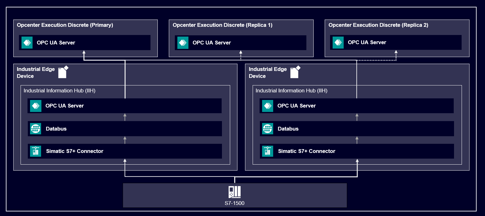

# Redundancy With Opcenter and IIH
- [Redundancy With Opcenter and IIH](#redundancy-with-opcenter-and-iih)
  - [Description](#description)
    - [Overview](#overview)
    - [General Task](#general-task)
  - [Requirements](#requirements)
    - [Prerequisites](#prerequisites)
    - [Used Components](#used-components)
  - [Installation](#installation)
    - [Setup IIH](#setup-iih)
    - [Setup Opcenter Execution Discrete](#setup-opcenter-execution-discrete)
  - [Available Contracts:](#available-contracts)
  - [Runtime Scenario](#runtime-scenario)

## Description

### Overview

In a process, where the data transfer is an essential component of the workflow, hardware failures might slow down or even endanger the process.
Therefor in this repository we explain how to setup a redundant infrastructure of Industrial Edge with IIH and Opcener Execution Core.
This example should serve as a blueprint, if a similar redundant infrastructure is needed.

### General Task

This tutorial describes the steps, that are necessary to create a redundant communication  from the PLC over Industrial Edge to Opecenter.
Following graphic illustrates the final structure.

## Requirements
### Prerequisites
- Industrial Edge Management License for two devices
  - Purchased apps: Common Configurator, IIH Semantics, IIH Essentials, Registry Service, Databus, Databus Gateway, and SIMATIC S7+ Connector
- Opcenter Execution Discrete License
- TIA Portal License
- PLCSIM Advanced License
  
### Used Components
- TIA-Portal
- Industrial Edge Management (IEM)
- Industrial Edge Device (IED)
- Opcenter Execution Discrete

## Installation

By meticulously following these steps, you'll establish a robust and synchronized environment for your industrial automation operations.

### Setup IIH

The guide is provided [here](docs/iih_setup.md).

### Setup Opcenter Execution Discrete

The guide is provided [here](docs/opscenter_setup.md).

## Available Contracts:

- Execute Save Sequence
- Request Next
- Request Order Info
- Execute Work Order Operation
- Execute Work Instruction Data Collection
- Execute Quality Inspection
- Track Item Location Single

## Runtime Scenario

Both IEDs are setup redundant, therefor both IEDs are collecting data simultanously. The Opcenter installation is subscribed to both OPC UA Servers running on the IEDs. If one IED has a failure, Opcenter automatically detects the failure and switches to the redundant alternative. 
In turn, when one instance of Opcenter crashes, the Secondary instances of Opcenter are taking over.  

